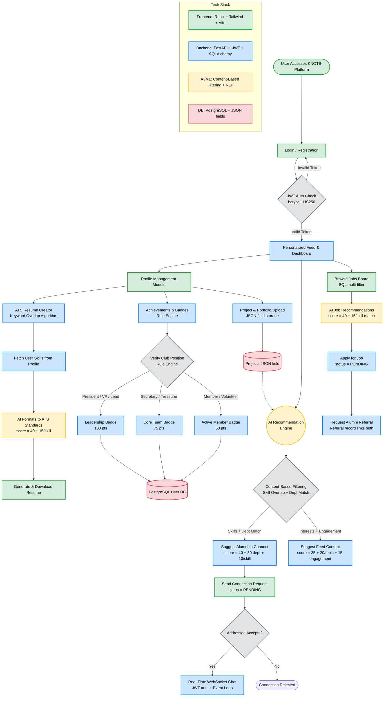

# KNOTS — Technical Approach Flowchart
### SIH 2025 Presentation Slide

> Paste any of these Mermaid code blocks into [mermaid.live](https://mermaid.live) to export high-quality PNG images for your PPT.

---

## Main User Journey Flowchart

---

## Sentinel Six Style — Linear Pipeline Flow

---

## Technologies & Tools (For PPT Right Panel)

**Frontend**
- React.js (TypeScript + TSX)
- Tailwind CSS
- Vite (build tool)
- React Router, TanStack Query, Recharts

**Backend**
- Python — FastAPI (async)
- SQLAlchemy (async ORM)
- Alembic (DB migrations)
- WebSockets (real-time chat)

**Security**
- JWT — JSON Web Tokens (HS256)
- bcrypt password hashing
- RBAC (Role-Based Access Control)

**Database**
- PostgreSQL (primary relational DB)
- JSON fields for skills, projects, certifications
- UUID-based file naming for profile pictures

**AI / ML**
- Content-Based Filtering (connections, jobs, feed)
- Keyword Overlap Algorithm (ATS resume scoring)
- Rule Engine (badge allocation by position)
- LLM Integration — placeholder for resume critique + career roadmap

**DevOps**
- GitHub Actions CI/CD (`ci-cd.yml`)
- Docker-ready structure
