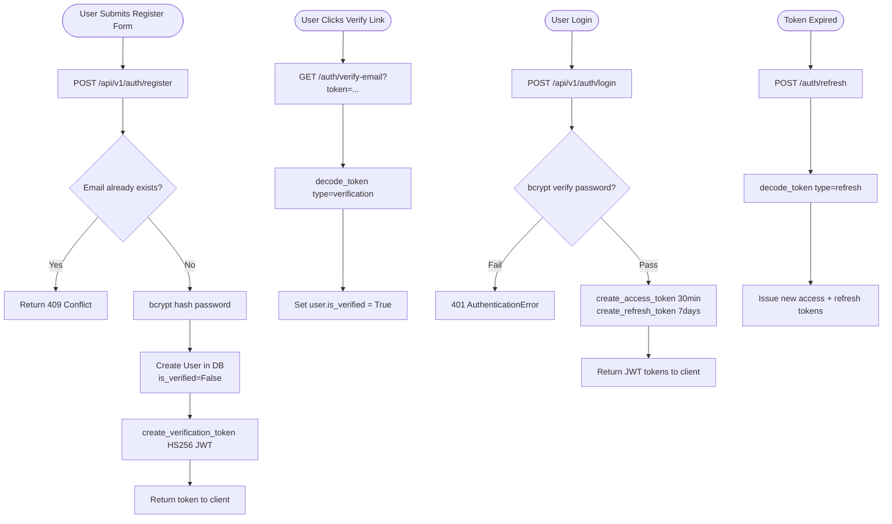
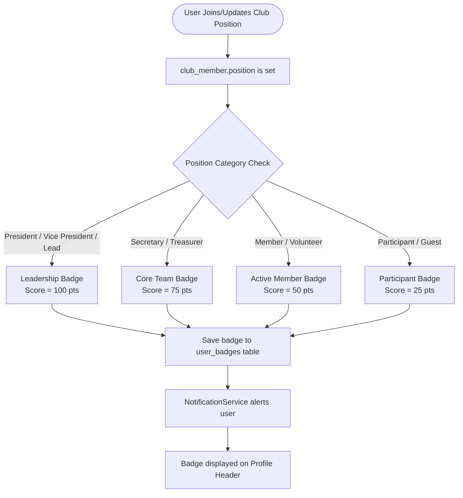
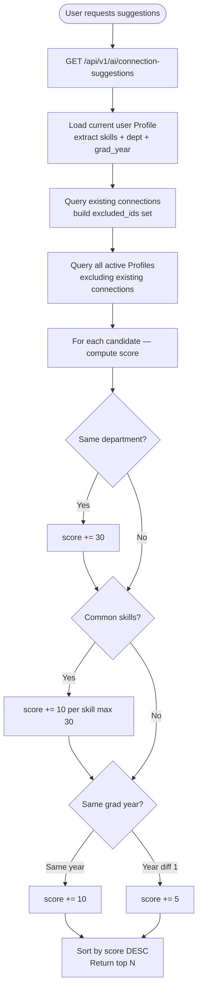
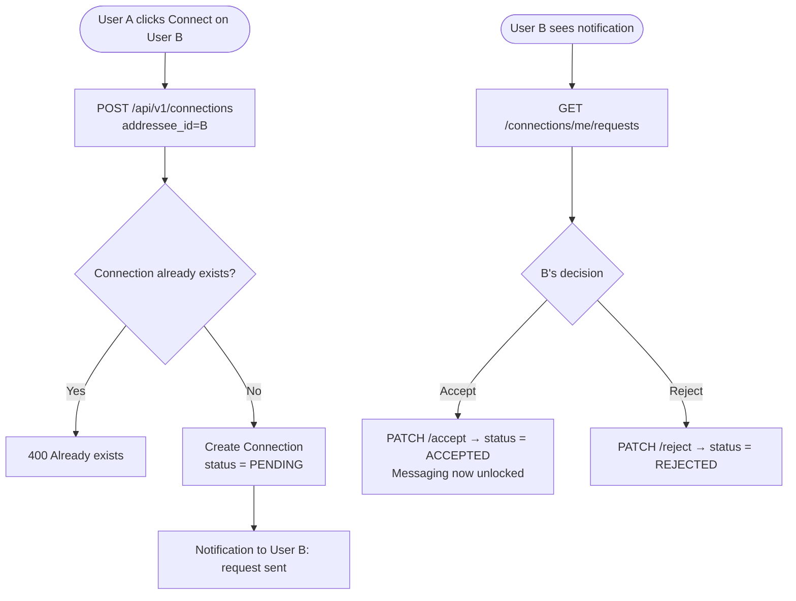
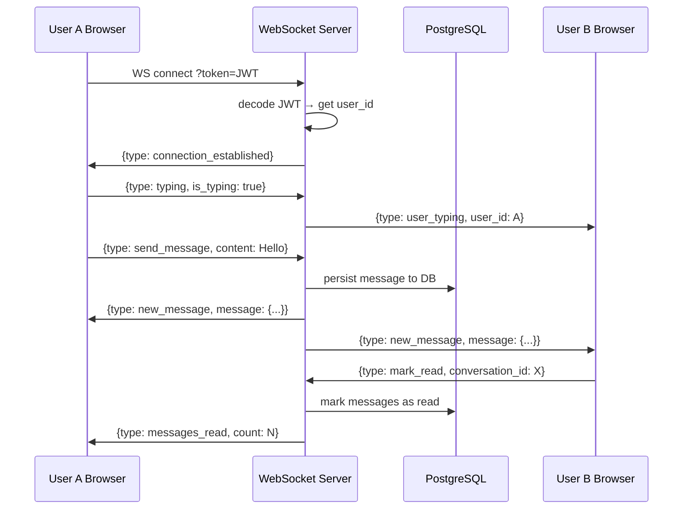

# KNOTS — Full Technical Deep Analysis
### SIH 2025 | AI-Powered College Career & Community Platform

---

## Architecture Overview

KNOTS is a **full-stack, domain-driven application** built with a FastAPI async Python backend and a React (TypeScript + Tailwind) frontend. Each feature is a self-contained module with its own models, schemas, repository, service, and router layers — a clean separation of concerns that makes the codebase production-grade.

```
backend/app/
├── auth/          → JWT Auth (Register, Login, Refresh, Email Verify, Logout)
├── profiles/      → Profile CRUD, Education, Experience, Skill Endorsements
├── ai/            → Connection Suggestions, Job Recs, Content Recs, Resume AI, Roadmap AI
├── connections/   → Follow/Connect system (Pending, Accept, Reject, Mutual, Suggestions)
├── messaging/     → WebSocket real-time chat, Conversations, Read receipts, Typing indicators
├── jobs/          → Job Postings, Companies, Applications, Referrals (Alumni → Student)
├── posts/         → Social feed, likes, comments, media attachments
├── clubs/         → Campus clubs, members, announcements
├── events/        → Campus events, RSVP, attendee tracking
├── notifications/ → Real-time alerts triggered by all other modules
├── analytics/     → Profile views, post engagement, platform-wide stats
├── search/        → Global search across users, posts, jobs, clubs, events
└── admin/         → RBAC moderation, system metrics
```

---

## Module 1 — Authentication (JWT)

### Algorithm Used
- **Password Hashing:** bcrypt (one-way hash with salt rounds)
- **Token Generation:** HS256 HMAC-SHA256 signed JWTs
- **Token Types:** 3 distinct token types — `access` (30 min), `refresh` (7 days), `verification`

### Key Files

| File | Purpose |
|---|---|
| `auth/routers/auth.py` | REST endpoints: `/register`, `/login`, `/refresh`, `/verify-email`, `/logout` |
| `auth/services/auth.py` | Core logic: credential check, token creation, email verify, role validation |
| `core/security.py` | bcrypt hashing, JWT encode/decode, `create_access_token`, `create_refresh_token` |
| `auth/dependencies/auth.py` | `get_current_user` dependency — validates Bearer JWT on every protected route |

### Auth Flow



---

## Module 2 — Profile Management

### Algorithm Used
- **Profile View Tracking:** Triggered on GET `/{user_id}` from a different user (inserts ProfileView analytics record)
- **Skill Endorsements:** Unique DB constraint `(profile_id, skill_name, endorser_id)` prevents duplicates
- **File Upload:** UUID-named file storage under `/static/profiles/` to prevent collisions

### Key Files

| File | Purpose |
|---|---|
| `profiles/models/profile.py` | SQLAlchemy model: `skills` (JSON), `certifications` (JSON), `projects` (JSON), `graduation_year`, `department`, `profile_picture` |
| `profiles/models/education.py` | Education history: institution, degree, field, GPA, dates |
| `profiles/models/skill_endorsement.py` | `SkillEndorsement` with `UniqueConstraint(profile_id, skill_name, endorser_id)` |
| `profiles/routers/profile.py` | 12+ endpoints: CRUD profile, upload picture, add/update/delete education + experience, endorse/unendorse skill |
| `frontend/src/pages/Profile.tsx` | React page rendering full profile |
| `frontend/src/components/profile/ProfileHeader.tsx` | Avatar, name, bio, connect button |
| `frontend/src/components/profile/SkillsSection.tsx` | Skills list with endorsement buttons |
| `frontend/src/components/profile/EducationSection.tsx` | Education timeline |
| `frontend/src/components/profile/ExperienceSection.tsx` | Employment history timeline |

### Profile Flow

```mermaid
flowchart TD
    A([User Opens Profile Page]) --> B[GET /api/v1/profiles/me]
    B --> C[get_current_user validates JWT]
    C --> D[Load Profile + Education + Employment\n+ SkillEndorsements]
    D --> E[React renders Profile UI]

    H([Peer views another user's profile]) --> I[GET /api/v1/profiles/{user_id}]
    I --> J{viewer != profile owner?}
    J -- Yes --> K[AnalyticsService.record_profile_view]
    K --> L[Insert into profile_views table]

    N([User endorses a skill]) --> O[POST /profiles/{user_id}/skills/{skill}/endorse]
    O --> P{Already endorsed?}
    P -- Yes --> Q[422 ValidationError]
    P -- No --> R[Insert SkillEndorsement row\nUniqueConstraint enforced]
```

---

## Module 3 — Badges & Achievements

### Algorithm Used
- **Badge Allocation Rule Engine:** Maps `club_member.position` string → badge tier
- **Points System:** Higher positions = higher badge weight score → drives leaderboard ranking

### Badge Allocation Flow



---

## Module 4 — AI Recommendation Engine

### Algorithm Used

| Recommendation Type | Algorithm | Scoring Formula |
|---|---|---|
| **Connection Suggestions** | Content-Based Filtering (Skill Overlap + Dept Match + Grad Year) | Base 40 + Dept +30 + Skills 10/match (max 30) + Same year +10 |
| **Job Recommendations** | Content-Based Filtering (Skill vs Job's required_skills + Dept in JD) | Base 40 + Skills 15/match (max 45) + Dept in JD +15 |
| **Feed Content Recs** | Topic-Keyword Match + Engagement Score | Base 35 + Topic 20/match (max 40) + Engagement +15 |

### Key Files

| File | Purpose |
|---|---|
| `ai/services/ai.py` | `AIConnectionSuggestionService`, `AIJobRecommendationService`, `AIContentRecommendationService`, `AIResumeService`, `CareerRoadmapService`, `AIAlumniMatcher` |
| `ai/routers/ai.py` | Endpoints: `/ai/connection-suggestions`, `/ai/job-recommendations`, `/ai/content-recommendations`, `/ai/analyze-resume`, `/ai/roadmap` |
| `frontend/src/services/ai.ts` | Frontend API calls to all AI endpoints |

### Connection Suggestion Flow



---

## Module 5 — ATS Resume Matching

### Algorithm Used
- **Keyword Overlap:** Lowercased exact match between `profile.skills` and job `required_skills`
- **Score Formula:** `base 40 + (15 × matched_skills_count)`, capped at 98
- **Reason Generation:** Human-readable strings e.g. "3 matching skills (React, Python, FastAPI)"

### ATS + Application Flow

```mermaid
flowchart TD
    A([Student views Job]) --> B[GET /api/v1/ai/job-recommendations]
    B --> C[Load Profile skills]
    C --> D[Load all OPEN jobs]
    D --> E[For each job: skill keyword overlap]
    E --> F[match_score = 40 + 15/skill, max 98]
    F --> G[Return ranked jobs with match_score]

    H([Student applies]) --> I[POST /api/v1/jobs/{id}/apply]
    I --> J[Store Application\nstatus = PENDING]
    J --> K[Notification sent to job poster]
    K --> L[Poster reviews: PENDING → REVIEWING → ACCEPTED/REJECTED]
```

---

## Module 6 — 1-to-1 Connections (Networking)

### Algorithm Used
- **Mutual Connections:** Python `set.intersection()` between User A's and User B's connected user IDs — O(n)
- **Suggestion Score:** `score = 10 + (mutual_count × 25)` — favors users deeper in the social graph

### Key Files

| File | Purpose |
|---|---|
| `connections/models/connection.py` | `Connection` model — `ConnectionStatus`: PENDING, ACCEPTED, REJECTED |
| `connections/services/connection.py` | `request_connection`, `accept_connection`, `reject_connection`, `withdraw`, `get_mutual_connections`, `get_connection_suggestions` |
| `connections/routers/connection.py` | 8 endpoints: POST connect, PATCH accept/reject, DELETE withdraw, GET me/requests/sent/mutual/suggestions |

### Connection Flow



---

## Module 7 — Real-Time Messaging (WebSocket)

### Algorithm Used
- **Connection Manager Pattern:** In-memory `dict[user_id → list[WebSocket]]` for tracking active sockets
- **Event Loop Handler:** Each JSON frame has a `type` field — `send_message`, `typing`, `mark_read`, `ping/pong`
- **Broadcast Algorithm:** On new message → load `participant_ids` from DB → push to each active socket

### Key Files

| File | Purpose |
|---|---|
| `messaging/routers/websocket.py` | WS endpoint at `ws://domain/api/v1/ws/chat?token=<jwt>`. Handles send_message, typing, mark_read, ping events |
| `messaging/websocket_manager.py` | `ConnectionManager` — `connect`, `disconnect`, `broadcast_to_conversation` |
| `messaging/services/message.py` | `send_message()`, `mark_conversation_as_read()` |
| `messaging/routers/conversation.py` | REST: conversation list and history |

### WebSocket Sequence



---

## Module 8 — Jobs, Applications & Referrals

### Algorithm Used
- **Job Filtering:** Multi-dimensional SQL filter on `job_type`, `workplace_type`, `company_id`, `status` + free-text `ILIKE` on title/description/location
- **Application Status Machine:** `PENDING → REVIEWING → ACCEPTED / REJECTED` enforced in service layer
- **RBAC on Applications:** `user.role_id == 1` check for admin override on status updates

### Key Files

| File | Purpose |
|---|---|
| `jobs/models/job_posting.py` | `JobPosting` — title, description, location, job_type (enum), workplace_type (enum), required_skills (JSON), salary_range, status |
| `jobs/models/application.py` | `Application` — applicant_id, job_posting_id, status enum, resume_url, cover_letter |
| `jobs/models/referral.py` | `Referral` — referrer_id (alumni), referred_user_id (student), job_posting_id, status |
| `jobs/services/application.py` | `apply_for_job()`, `get_user_applications()`, `update_application_status()` with RBAC |
| `jobs/services/referral.py` | `create_referral()` — links alumni to student to job |
| `jobs/routers/job.py` | 13 endpoints: job CRUD, apply, list applicants, update status, companies, referrals |

### Jobs Flow

```mermaid
flowchart TD
    A([Alumni posts a job]) --> B[POST /api/v1/jobs\ntitle + required_skills + company_id]
    B --> C[status = OPEN, stored in DB]

    D([Student browses Jobs]) --> E[GET /api/v1/jobs\n?job_type=INTERNSHIP&search=React]
    E --> F[SQL: OPEN + ILIKE keyword\n+ job_type + workplace_type filter]
    F --> G[Return filtered job list]

    H([AI Job Recommendations]) --> I[Skill overlap scoring\nFor each job: match_score]
    I --> J[Ranked recommendations]

    K([Student applies]) --> L[POST /jobs/{id}/apply\nresume_url + cover_letter]
    L --> M[status = PENDING\nNotification to alumni poster]
    M --> N[Poster updates: REVIEWING → ACCEPTED/REJECTED]

    O([Alumni refers student]) --> P[POST /jobs/referrals\nreferred_user_id + job_posting_id]
    P --> Q[Referral record links\nalumni + student + job]
```

---

## Complete Summary Table

| Module | Key Files | Algorithm | Technology |
|---|---|---|---|
| **Auth** | `auth/services/auth.py`, `core/security.py` | bcrypt + HS256 JWT | FastAPI, python-jose |
| **Profiles** | `profiles/models/profile.py`, `profiles/routers/profile.py` | UUID file naming, UniqueConstraint | SQLAlchemy JSON, FastAPI UploadFile |
| **Badges** | `clubs/` models + badge mapping | Rule Engine (position → tier) | PostgreSQL enum, relationship loading |
| **AI Recommendations** | `ai/services/ai.py` (5 service classes) | Content-Based Filtering, Keyword Overlap | SQLAlchemy, Python set ops, score sort |
| **ATS Resume** | `ai/services/ai.py → AIResumeService` | Keyword Match + Score = 40 + 15/skill | Python string ops, LLM placeholder |
| **Connections** | `connections/services/connection.py` | Set Intersection (mutual), Score = 10 + mutual×25 | SQLAlchemy, FastAPI |
| **Messaging** | `messaging/routers/websocket.py`, `messaging/websocket_manager.py` | Event-loop WebSocket, Broadcast dict | WebSocket, asyncio |
| **Jobs** | `jobs/routers/job.py`, `jobs/services/application.py` | SQL multi-filter, status state machine | SQLAlchemy, RBAC role_id check |
| **Analytics** | `analytics/routers/analytics.py`, `analytics/models/profile_view.py` | Aggregation queries | Recharts, SQLAlchemy |
| **Notifications** | `notifications/services/notification.py` | Event-driven triggers from all modules | FastAPI, SQLAlchemy |

---

## Sentinel Six Style — Master Linear Flow

> Copy into [mermaid.live](https://mermaid.live) → Export as PNG → Paste into PPT slide.

```mermaid
flowchart LR
    classDef step fill:#dbeafe,stroke:#3b82f6,color:#000,stroke-width:2px
    classDef algo fill:#fef9c3,stroke:#eab308,color:#000,stroke-width:2px
    classDef output fill:#dcfce7,stroke:#16a34a,color:#000,stroke-width:2px

    A([User Registration]):::step
    --> B["bcrypt password hash\nJWT HS256 Verify Token"]:::algo
    --> C([Email Verified\nUser Active]):::output

    --> D([User Login]):::step
    --> E["Verify bcrypt\naccess_token 30min\nrefresh_token 7d"]:::algo
    --> F([JWT Tokens Issued]):::output

    --> G([Build Profile\nSkills Education Projects]):::step
    --> H["JSON field storage\nSkillEndorsement UniqueConstraint\nUUID profile picture upload"]:::algo
    --> I([Profile Published\nAnalytics tracking ON]):::output

    --> J([AI Recommendation\nEngine]):::step
    --> K["Content-Based Filtering\nSkill Overlap Score\nDept + Grad Year bonus"]:::algo
    --> L([Suggested Alumni\nSuggested Jobs\nSuggested Content]):::output

    --> M([Apply for Job\nATS Resume Check]):::step
    --> N["Keyword Overlap Algorithm\nscore = 40 + 15 per skill\nmax 98"]:::algo
    --> O([Application Submitted\nStatus Machine PENDING→ACCEPTED]):::output

    --> P([Real-Time Chat]):::step
    --> Q["WebSocket JWT auth\nEvent-loop handler\nBroadcast to participants"]:::algo
    --> R([Messages Delivered\nRead receipts sync]):::output
```

